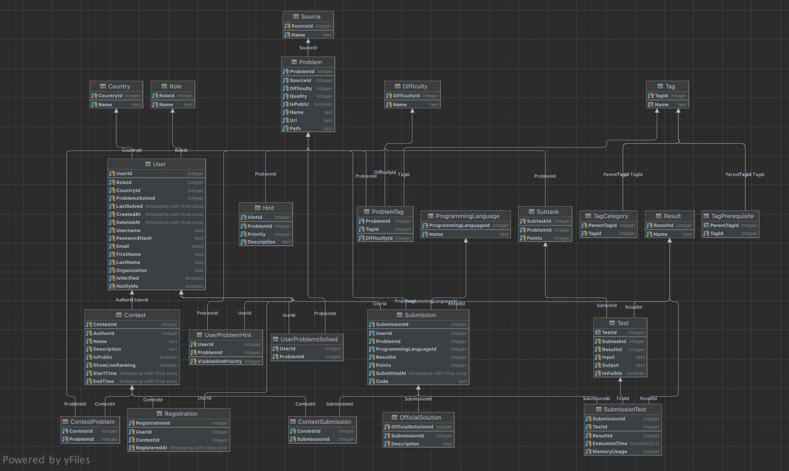

# **AlgoAcademy**  
<!--  -->

## **Introduction**
Website similar to leetcode. Allows to submit own solutions to math or CS problems and get a result. Also contains builtin editor for admins

## **Features**
- login with tokenized sessions
- register
- finished database with filled exampled data
- admin panel
- problem search engine
- problem submit logic
- ranking page

## **Installation and Launch**
### Client side
1. Set your current directory to `./Cient`
1. run `yarn start` (yarn has to be installed)

### Server side
1. Set your current directory to `./Server`
1. run `node index.js`

WARNING!

database has to be established in "algoacademy" database.
File does not provide database settelment, therefore please craete new one and import installation file for database

## **Database Schematics**
